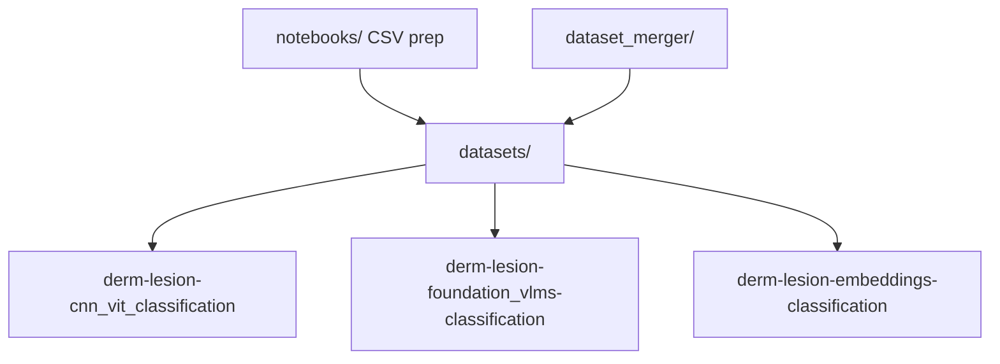

# derm-bench

"Bridging Research and Practice: A Systematic Evaluation of Generalist and Dermatology-Specific Models in Clinical Skin Lesion Classification", approved at [MICCAI2026](), [Paper]()

Benchmark suite for **binary benign vs. malignant** dermatology lesion classification across public and merged datasets, comparing three complementary modeling paradigms in a single monorepo.

## Overview

`derm-bench` standardizes data preparation, evaluation protocols, and reporting for skin-lesion malignancy prediction. All pipelines share the same task definition (two classes: `benign` and `malignant`) and a common on-disk dataset layout under `datasets/`. Each sub-project implements a different approach:

| Project | Paradigm | Input format | Configuration |
|---------|----------|--------------|---------------|
| [derm-lesion-cnn_vit_classification](derm-lesion-cnn_vit_classification/) | Fine-tune end-to-end image classifiers (CNN, ViT, DINOv3) | CSV metadata + `images/` | `configuration/config.yaml` |
| [derm-lesion-foundation_vlms-classification](derm-lesion-foundation_vlms-classification/) | Vision-language and dual-encoder models (prompt-based / similarity) | CSV metadata + `images/` (test split) | `configuration_yaml/setup_config.yaml` |
| [derm-lesion-embeddings-classification](derm-lesion-embeddings-classification/) | Frozen foundation backbones → embeddings → classical / MLP heads | H5 metadata + `images/` | `configuration/config.yaml` |



## Features

- **Unified task:** Binary malignancy classification with consistent labels and metrics across pipelines.
- **Multiple public datasets:** HAM10000, ISIC18/24, PAD, HC, DDI, SD-198, segmented variants, and merged corpora.
- **Reproducible workflows:** YAML-driven configuration and `Makefile` targets per project.
- **Aggregated reporting:** Summary CSVs and comparison plots from per-run metrics.
- **Dataset tooling:** Jupyter notebooks for per-source ETL and a merger for combined benchmarks.

## Repository layout

```
derm-bench/
├── README.md
├── LICENSE
├── datasets/                          # User-provided (not versioned)
├── notebooks/                         # Per-dataset preprocessing notebooks
├── dataset_merger/                    # Build merged_clinic, merged_dermatoscopic, merged
├── derm-lesion-cnn_vit_classification/
├── derm-lesion-foundation_vlms-classification/
└── derm-lesion-embeddings-classification/
```

## Prerequisites

- **Python 3.10+** recommended for all sub-projects.
- **CUDA-capable GPU** strongly recommended for CNN/ViT training, large VLMs, and DINOv3 / Derm Foundation embedding extraction.
- **Disk space:** Raw dermatology image collections are large; plan tens of GB per full benchmark grid.
- **Optional:** [Ollama](https://ollama.com/) for local vision-language models in the VLM project.

## Dataset layout

Place prepared datasets at the repository root under `datasets/<dataset_name>/`:

```
datasets/<dataset_name>/
├── images/                            # RGB lesion images (.jpg, .jpeg, .png)
├── train_metadata.csv
├── validation_metadata.csv
└── test_metadata.csv
```

### Required CSV columns

| Column | Description |
|--------|-------------|
| `img_id` | Image filename or stem (extension added automatically if missing) |
| `benign_malignant` | Ground-truth label: `benign` or `malignant` (case-insensitive) |

Rows with missing labels or missing image files are dropped during loading.

### Optional columns

| Column | Used by |
|--------|---------|
| `partition` | VLM evaluation (filters to `test` when present) |
| Patient / clinical metadata | VLM `vlm_prompt_patient_info` config (ISIC, HC, PAD datasets) |

### Preparing datasets

1. Run the relevant Jupyter notebooks in [`notebooks/`](notebooks/) to convert each public source into the layout above (e.g. `ham.ipynb`, `isic18.ipynb`, `isic24.ipynb`, `pad.ipynb`, `hc.ipynb`, `ddi.ipynb`, `sd-198.ipynb`).
2. Optionally build merged benchmarks from the repo root:

```bash
cd dataset_merger
python3 merge_datasets.py
```

This creates three merged folders under `datasets/`:

| Output name | Source datasets |
|-------------|-----------------|
| `merged_clinic` | HC, PAD, ddi, sd-198 |
| `merged_dermatoscopic` | ISIC18, ISIC24 |
| `merged` | All of the above |

See [`dataset_merger/merge_datasets.py`](dataset_merger/merge_datasets.py) and [`dataset_merger/merger.py`](dataset_merger/merger.py) for implementation details.

### Embeddings pipeline note

The [embeddings project](derm-lesion-embeddings-classification/) expects **HDF5 partition files** (`train_metadata.h5`, etc.) rather than CSV. Convert CSV partitions to H5 with your own tooling before running `make embeddings`.

## Getting started

1. **Prepare data** — Run notebooks → populate `datasets/`.
2. **Merge (optional)** — `cd dataset_merger && python3 merge_datasets.py`.
3. **Choose a pipeline** — `cd` into one of the three `derm-lesion-*` directories.
4. **Install dependencies** — `pip install -r requirements.txt` (see sub-project README).
5. **Edit configuration** — Adjust models, datasets, and paths in the project YAML file.
6. **Run** — Use `make` targets documented in each sub-project README.

## Sub-project documentation

| Project | README |
|---------|--------|
| CNN / ViT fine-tuning | [derm-lesion-cnn_vit_classification/README.md](derm-lesion-cnn_vit_classification/README.md) |
| VLM / dual-encoder evaluation | [derm-lesion-foundation_vlms-classification/README.md](derm-lesion-foundation_vlms-classification/README.md) |
| Embedding + classifier heads | [derm-lesion-embeddings-classification/README.md](derm-lesion-embeddings-classification/README.md) |

## Supporting components

### `dataset_merger/`

`DatasetMerger` copies images from selected source datasets into a single `images/` folder, resolves duplicate `img_id` values, and writes merged `train_metadata.csv`, `validation_metadata.csv`, and `test_metadata.csv` for each partition.

### `notebooks/`

Interactive preprocessing for individual dermatology benchmarks. Outputs should match the shared CSV layout under `datasets/`.

### `datasets/`

Not tracked in git (see [`.gitignore`](.gitignore)). You must download or generate data locally before running any pipeline.

## Known limitations

- The VLM project `Makefile` target `dataset-merge` points to a missing `scripts/merge_datasets.py`. Use [`dataset_merger/merge_datasets.py`](dataset_merger/merge_datasets.py) at the repo root instead.
- The embeddings pipeline requires H5 metadata; CSV→H5 conversion is not included in this repository.
- Some import paths in the VLM project may need alignment with `src/vlms/base_model.py` before `make eval` runs successfully.

## License

This project is licensed under the [Apache License 2.0](LICENSE).

## Acknowledgments

The project was supported by the Ministry of Science, Technology, and Innovation of Brazil, with resources from Law No. 8,248, dated October 23, 1991, under the scope of the PPI-SOFTEX, coordinated by Softex and published under RESIDÊNCIA EM TIC 63 – ROBÓTICA E IA – FASE II, DOU 23076.043130/2025-27 and partially supported by INES.IA (National Institute of Science and Technology for Software Engineering Based on and for Artificial Intelligence) www.ines.org.br, CNPq grant 408817/2024-0.

## Contact

website: [Criar](criar.cin.ufpe.br)\
email: criar@softex.cin.ufpe.br;\
authors email: etcs@softex.cin.ufpe.br; kbc@softex.cin.ufpe.br; tir@cin.ufpe.br

## Citation

{}
