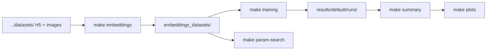

# derm-lesion-embeddings-classification

Two-stage benchmark for **benign vs. malignant** dermatology lesion classification: extract frozen foundation-model embeddings, then train lightweight classifiers (sklearn + MLP) on embedding vectors.

## Overview

This project separates representation learning from classification:

1. **Embedding extraction** — Frozen vision backbones encode images into fixed-size vectors stored in HDF5 files.
2. **Classifier training** — Random Forest, XGBoost, SVM, or a PyTorch MLP train on those vectors.
3. **Optional hyperparameter search** — Optuna tunes ML and MLP settings (independent from default training).

Part of the [derm-bench](../README.md) monorepo. For CSV-based dataset layout used by other pipelines, see the [root README](../README.md). This project expects **H5 metadata partitions**.

## Features

- Five foundation backbones: Google Derm Foundation, DINOv2 giant, and three DINOv3 variants.
- Four classifier heads with balanced-class handling for tree/SVM models.
- Optional train-time augmentation and undersampling during extraction/training.
- Optuna hyperparameter search for ML (5-fold CV) and MLP (early stopping).
- Metrics summaries, ROC/confusion plots, and wrong-prediction analysis.

## Project structure

```
derm-lesion-embeddings-classification/
├── Makefile
├── requirements.txt
├── configuration/
│   └── config.yaml                 # Backbones, datasets, models, paths
├── scripts/
│   ├── dataset/
│   │   └── embedding_dataset.py    # Embedding extraction entrypoint
│   ├── parameters_tunning/
│   │   ├── parameters_search_ml.py
│   │   └── parameters_search_dl.py
│   └── pipeline/
│       ├── classificator_training.py
│       ├── metrics_summary.py
│       ├── plot_summary.py
│       └── wrong_predictions.py
├── src/
│   ├── architectures/backbones/  # DINOv3, Derm Foundation, DINOv2
│   ├── architectures/heads/        # ML and MLP classifiers
│   ├── embeddings/                 # Extractor, H5 I/O, augmentation
│   ├── mlp_trainer/
│   ├── metrics/
│   ├── parameters_search/
│   └── training/
├── embeddings_datasets/            # Generated H5 embeddings (gitignored)
├── models/                         # Local weights and HF cache (gitignored)
└── results/                        # Training outputs and summaries
```

## Prerequisites

- Python 3.10+
- CUDA GPU recommended (especially for DINOv3 ViT-7B and DINOv2 giant)
- Raw images + **H5 metadata** under `../datasets/<name>/`
- Local weight files for DINOv3 and Derm Foundation in `./models/` (see [Installation](#installation))
- **TensorFlow (CPU)** for Derm Foundation extraction (per-image, not batched)

## Dataset layout

### Input (extraction source)

Read from `dataset_root_folder` (default `../datasets`):

```
../datasets/<dataset_name>/
├── images/
├── train_metadata.h5
├── validation_metadata.h5
└── test_metadata.h5
```

#### H5 fields (input)

| Dataset key | Required | Description |
|-------------|----------|-------------|
| `img_id` | Yes | Image filename or stem |
| `benign_malignant` | Yes | `benign` or `malignant` (also accepts `labels`) |

### Output (after extraction)

Written to `embeddings_datasets/{backbone}/{dataset}/`:

```
embeddings_datasets/<backbone>/<dataset_name>/
├── train_metadata.h5       # Adds embeddings matrix (N, input_dim)
├── validation_metadata.h5
└── test_metadata.h5
```

Augmented training rows use IDs like `{img_id}_aug_{k}` when augmentation is enabled.

### CSV → H5 conversion

Other `derm-bench` pipelines use CSV metadata. You must convert `train_metadata.csv` (and val/test) to H5 before running `make embeddings`. This conversion is **not** included in the repository.

### Configured datasets (default)

ddi, sd-198, PAD, HC, ISIC24, ISIC18, HAM10000, merged_clinic, merged_dermatoscopic, merged.

## Installation

```bash
python3 -m venv .venv
source .venv/bin/activate
pip install -r requirements.txt
```

### Backbone weights

| Backbone | Expected location |
|----------|-------------------|
| `derm_foundation` | `./models/derm_foundation/` (TensorFlow SavedModel for `google/derm-foundation`) |
| `dinov2_giant` | Hugging Face cache under `./models/` |
| `dinov3_convnext_tiny` | `./models/dinov3_weights/dinov3_convnext_tiny.pth` |
| `dinov3_vith16plus` | Local DINOv3 hub weights (see `src/architectures/backbones/`) |
| `dinov3_vit7b16` | Local DINOv3 hub weights |

DINOv3 models load via local `torch.hub` from vendored hub code under `src/architectures/backbones/dinov3/`.

## Configuration

Primary file: [`configuration/config.yaml`](configuration/config.yaml).

| Key | Description |
|-----|-------------|
| `resources` | Per-backbone paths: `model_name`, `dataset_path`, `train_output_path`, `input_dim` |
| `dataset_root_folder` | Raw image + H5 source root (default: `../datasets`) |
| `datasets` | Dataset names to process |
| `models` | Classifiers: `random_forest`, `xgboost`, `svm`, `mlp` |
| `partitions` | H5 filenames: `train_metadata.h5`, etc. |
| `extraction_batch_size` | Batch size for embedding extraction (default: 2056) |
| `cuda_empty_cache_every_batch` | Clear CUDA cache between batches |
| `csv_output_path` / `plot_*` | Summary and plot output directories |
| `augmentation` | Train-only augmentation settings (disabled by default) |
| `undersampling` | Train undersampling during classifier training (disabled by default) |

## Usage



### Recommended order

```bash
make embeddings        # 1. Extract embeddings for all backbones × datasets
make param-search      # 2. Optional Optuna HPO (ML + MLP)
make training          # 3. Train classifiers on embeddings
make summary           # 4. Aggregate metrics
make plots             # 5. Generate comparison plots
make wrong-predictions # 6. Optional error analysis
```

**Note:** Default `make training` does not load best hyperparameters from `make param-search`; HPO and production training are separate workflows.

### Makefile targets

| Target | Description |
|--------|-------------|
| `make embeddings` | Run embedding extraction |
| `make param-search` | Optuna search for MLP then ML models |
| `make training` | Train all backbone×dataset×classifier combinations |
| `make summary` | Generate metrics summary CSVs |
| `make plots` | Generate metric plots |
| `make wrong-predictions` | Export misclassified examples |
| `make help` | Show commands (includes unimplemented `dimension-plots`, `venn-and-histograms`) |

### Examples

```bash
python3 -m scripts.dataset.embedding_dataset --config ./configuration/config.yaml
python3 -m scripts.pipeline.classificator_training --config ./configuration/config.yaml
```

## Backbones

Defined under `resources` in `configuration/config.yaml`.

| Resource key | `model_name` | Backend | `input_dim` |
|--------------|--------------|---------|-------------|
| `derm_foundation` | `google/derm-foundation` | TensorFlow (CPU), per-image | 6144 |
| `dinov2_giant` | `facebook/dinov2-giant` | Hugging Face Transformers | 1536 |
| `dinov3_convnext_tiny` | `dinov3_convnext_tiny` | Local torch.hub | 768 |
| `dinov3_vith16plus` | `dinov3_vith16plus` | Local torch.hub | 1280 |
| `dinov3_vit7b16` | `dinov3_vit7b16` | Local torch.hub | 4096 |

## Classifiers

| Name | Implementation | Notes |
|------|----------------|-------|
| `random_forest` | `RandomForestModel` | `class_weight=balanced_subsample` |
| `xgboost` | `XGBoostModel` | `binary:logistic` objective |
| `svm` | `SVMModel` | RBF kernel, `probability=True` |
| `mlp` | `MLPClassifier` + `MLPTrainer` | Fixed 512→256→2 architecture; Adam, label smoothing, ReduceLROnPlateau |

### Hyperparameter search (Optuna)

| Script | Output directory | Objective |
|--------|------------------|-----------|
| `parameters_search_ml.py` | `results_pure/parameters search/ml/` | 5-fold stratified CV, macro F1 |
| `parameters_search_dl.py` | `results_pure/parameters search/mlp/` | Dynamic MLP architecture, early stopping |

HPO MLP uses `DynamicMLPFactory` (variable depth/width); production MLP uses the fixed `MLPClassifier`.

## Outputs

### Embedding extraction

`embeddings_datasets/{backbone}/{dataset}/*_metadata.h5` with `embeddings` array shape `(N, input_dim)`.

### Classifier training

`{train_output_path}/{dataset}/{model}/` under each backbone resource (default: `results/default/runs/{backbone}/`):

- Test metrics, confusion matrices, ROC curves (per implementation)
- Skipped if output directory already exists

### Summaries and plots

| Path | Description |
|------|-------------|
| `results/default/summary/` | Aggregated metric CSVs |
| `results/default/plots/` | Comparison plots |
| `results/default/dataset_plot/` | Per-dataset plots |
| `results/default/label_plots/` | Per-label plots |
| `results_pure/parameters search/` | Optuna HPO artifacts |

## Augmentation and undersampling

**Augmentation** (config `augmentation.enabled`): applied to **training partition only** during extraction (`per_image` copies, flips, crop, blur, etc.).

**Undampling** (config `undersampling.enabled`): applied during classifier training; methods include `min_class`, `max_per_class`, `ratio`.

Both are **disabled by default**.

## Related components

- [derm-bench root README](../README.md) — Shared task definition and CSV dataset layout.
- [dataset_merger](../dataset_merger/) — Merged CSV datasets (convert to H5 before this pipeline).
- [notebooks](../notebooks/) — Per-source preprocessing to CSV.
- [derm-lesion-cnn_vit_classification](../derm-lesion-cnn_vit_classification/) — End-to-end fine-tuning on images.
- [derm-lesion-foundation_vlms-classification](../derm-lesion-foundation_vlms-classification/) — VLM evaluation on the same task.

## License

Licensed under the [Apache License 2.0](../LICENSE).
