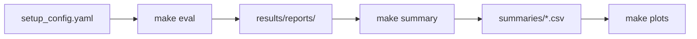

# derm-lesion-foundation_vlms-classification

Benchmark for **benign vs. malignant** dermatology lesion classification using vision-language models (VLMs), dual-encoder image–text models, and Ollama-hosted vision models with multiple prompting strategies.

## Overview

This project evaluates pretrained VLMs and CLIP-style encoders in a **zero-shot / prompt-based** setting: models classify test images without fine-tuning on lesion labels. A grid runs over **model × dataset × prompt configuration**, writes per-image predictions and aggregate metrics, then summarizes results across the benchmark.

Part of the [derm-bench](../README.md) monorepo. For shared dataset preparation, see the [root README](../README.md).

## Features

- Four prompt strategies: dual-encoder similarity, simple dermatologist prompt, patient-metadata-enriched prompt, and ABCDE-rule-guided prompt.
- Hugging Face dual-encoders (CLIP, MedSigLIP, BiomedCLIP) and instruct VLMs (Qwen, MedGemma, Phi).
- Ollama integration for large local vision models (Llama, Qwen, Gemma).
- Resume-friendly evaluation: skips combinations when the output directory already exists.
- Per-run `binary.csv` predictions and `binary.txt` metrics; cross-model summary CSVs and plots.

## Project structure

```
derm-lesion-foundation_vlms-classification/
├── Makefile
├── requirements.txt
├── configuration_yaml/
│   ├── setup_config.yaml             # Master config (models, datasets, paths)
│   ├── vlm_dual_encoder.yaml         # Label-only config for similarity models
│   ├── vlm_prompt_simple.yaml
│   ├── vlm_prompt_patient_info.yaml
│   └── vlm_prompt_abcde_rules.yaml
├── scripts/
│   ├── evaluation.py                 # Evaluation entrypoint
│   ├── results_summary.py
│   └── results_plots.py
├── src/
│   ├── eval/
│   │   └── eval_pipeline.py          # Model routing and eval grid
│   ├── vlms/                         # Model wrappers (CLIP, Qwen, Ollama, …)
│   └── metrics/                      # Metrics, aggregation, plots
├── models/                           # Downloaded HF / local weights (gitignored)
└── results/
    ├── reports/                      # Per-run predictions and metrics
    ├── summaries/                    # Aggregated CSV matrices
    └── plots/
```

## Prerequisites

- Python 3.10+
- CUDA GPU recommended for Hugging Face VLMs and dual-encoders
- Prepared datasets under `../datasets/` with `test_metadata.csv`
- **Optional — Ollama:** For Ollama models listed in config; install via `make install-ollama` and pull weights via `make pull-models`
- **Optional — open_clip:** Required for BiomedCLIP (`pip install open_clip_torch`)

## Dataset layout

Datasets are read from `datasets_root_path` (default `../datasets`). Evaluation uses **test split only** from `test_metadata.csv`.

```
../datasets/<dataset_name>/
├── images/
├── train_metadata.csv                # Used by merger only
├── validation_metadata.csv
└── test_metadata.csv                 # Required for evaluation
```

### CSV columns

| Column | Required | Description |
|--------|----------|-------------|
| `img_id` | Yes | Image filename or stem under `images/` |
| `benign_malignant` | Yes | `benign` or `malignant` |
| `partition` | No | When present, only rows with `partition == test` are evaluated |

### Patient-metadata columns (for `vlm_prompt_patient_info`)

| Dataset | Example columns |
|---------|-----------------|
| ISIC18 / ISIC24 / HAM10000 | `age_approx`, `sex`, `anatom_site_general`; ISIC24 also `clin_size_long_diam_mm` |
| HC | `bodyPart_pt` |
| PAD | Demographics, symptoms, lifestyle, cancer history fields |

Datasets without extra metadata (`ddi`, `sd-198`) use image-only prompts even in the patient-info config.

### Configured datasets (default)

ddi, sd-198, HC, PAD, ISIC24, ISIC18, HAM10000, merged_clinic, merged_dermatoscopic, merged.

## Installation

```bash
python3 -m venv .venv
source .venv/bin/activate
make install
```

`make install` runs `pip install -r requirements.txt` and upgrades `transformers`.

For BiomedCLIP:

```bash
pip install open_clip_torch
```

### Ollama (optional)

```bash
make install-ollama    # Install Ollama via official script
make pull-models       # Pull llama3.2-vision, llama4, qwen2.5vl, gemma3, etc.
```

**Ollama API endpoint:** `OllamaInferRequest` defaults to `http://192.168.155.1:13755` (not `localhost`). Update `api_url` in `src/vlms/ollama_base_request.py` or subclass configuration to match your environment before running Ollama models.

### Merged datasets

Use the root merger (the local `make dataset-merge` target references a missing script):

```bash
cd ../dataset_merger
python3 merge_datasets.py
```

## Configuration

Primary file: [`configuration_yaml/setup_config.yaml`](configuration_yaml/setup_config.yaml).

| Key | Description |
|-----|-------------|
| `models` | HF dual-encoders, HF instruct VLMs, and Ollama model IDs |
| `datasets_root_path` | Dataset root (default: `../datasets`) |
| `datasets` | Dataset folder names to evaluate |
| `configs` | Prompt YAML stems (see table below) |
| `report_paths` | Per-config output directories under `results/reports/` |
| `csv_output_path` | Summary CSV directory |
| `plot_root` | Plot output directory |

### Prompt configurations

| Config name | YAML file | Description |
|-------------|-----------|-------------|
| `vlm_dual_encoder` | `vlm_dual_encoder.yaml` | `labels: [benign, malignant]` only — for similarity-based models |
| `vlm_prompt_simple` | `vlm_prompt_simple.yaml` | Dermatologist system + user prompt; image-only |
| `vlm_prompt_patient_info` | `vlm_prompt_patient_info.yaml` | Injects available patient/clinical metadata into the user prompt |
| `vlm_prompt_abcde_rules` | `vlm_prompt_abcde_rules.yaml` | ABCDE + “ugly duckling” checklist in system prompt; one-word label output |

## Usage



### Makefile targets

| Target | Description |
|--------|-------------|
| `make install` | Install Python dependencies |
| `make install-ollama` | Install Ollama |
| `make pull-models` | Download Ollama vision models |
| `make eval` | Run full model×dataset×config evaluation grid |
| `make summary` | Aggregate `binary.txt` reports into CSVs |
| `make plots` | Generate plots from summary CSVs |
| `make help` | Show available commands |

**Note:** `make dataset-merge` is broken in this folder; use [`../dataset_merger/merge_datasets.py`](../dataset_merger/merge_datasets.py) instead.

### Examples

```bash
make eval
make summary
make plots
```

### Direct script invocation

```bash
python3 -m scripts.evaluation --config ./configuration_yaml/setup_config.yaml
python3 -m scripts.results_summary --config ./configuration_yaml/setup_config.yaml
python3 -m scripts.results_plots --config ./configuration_yaml/setup_config.yaml
```

## Models

Routing is defined in `src/eval/eval_pipeline.py` → `load_model()`.

### Dual-encoder (Hugging Face similarity)

| Model ID | Wrapper |
|----------|---------|
| `openai/clip-vit-base-patch32` | `CLIPImageTextModel` |
| `openai/clip-vit-large-patch14` | `CLIPImageTextModel` |
| `google/medsiglip-448` | `MedSigLIP` |
| `hf-hub:microsoft/BiomedCLIP-PubMedBERT_256-vit_base_patch16_224` | `BiomedCLIP` |

Use with `vlm_dual_encoder` config.

### Instruct VLMs (Hugging Face)

| Model ID | Wrapper |
|----------|---------|
| `Qwen/Qwen2-VL-2B-Instruct` | `QwenModel` |
| `Qwen/Qwen2.5-VL-3B-Instruct` | `QwenModel` |
| `google/medgemma-4b-it` | `GemmaModel` |
| `google/medgemma-1.5-4b-it` | `GemmaModel` |
| `microsoft/Phi-3.5-vision-instruct` | `PhiModel` |

### Ollama (local API)

| Model ID |
|----------|
| `llama3.2-vision:11b` |
| `llama3.2-vision:90b` |
| `llama4:16x17b` |
| `qwen2.5vl:72b` |
| `gemma3:27b` |

Any model ID not matched above is routed to `OllamaInferRequest`.

### Inference contract

All wrappers extend `BaseImageTextModel` (`src/vlms/base_model.py`):

1. Load `test_metadata.csv` and images from `{dataset}/images/`.
2. Run `model_infer()` with prompts from the active config YAML.
3. Normalize output via `response_filter()` → `benign`, `malignant`, or `error`.
4. Write metrics via `MetricsHelper`.

## Outputs

Per evaluation run (`results/reports/{config}/{model}/{dataset}/`):

| File | Description |
|------|-------------|
| `binary.csv` | Per-image predictions and ground truth |
| `binary.txt` | Accuracy, macro precision/recall/F1, classification report |

After `make summary` (`results/summaries/`):

| File pattern | Description |
|--------------|-------------|
| `{config}__accuracy.csv` | Model×dataset accuracy matrix |
| `{config}__f1_avg.csv` | Model×dataset macro F1 matrix |
| `overall_best_by_accuracy.csv` | Best model per dataset |
| `overall_best_by_f1_avg.csv` | Best model per dataset by macro F1 |

After `make plots`: charts under `results/plots/`.

**Skip behavior:** If `results/reports/{config}/{model}/{dataset}/` already exists, that combination is skipped.

## Related components

- [derm-bench root README](../README.md) — Shared dataset contract.
- [dataset_merger](../dataset_merger/) — Build merged datasets.
- [notebooks](../notebooks/) — Per-source preprocessing.
- [derm-lesion-cnn_vit_classification](../derm-lesion-cnn_vit_classification/) — Fine-tuned CNN/ViT benchmark.
- [derm-lesion-embeddings-classification](../derm-lesion-embeddings-classification/) — Embedding-based classifiers.

## Known limitations

- Import paths in some modules reference `src.eval.base_model` or `src.utils.base_model` instead of `src.vlms.base_model`; align imports if `make eval` fails.
- `make dataset-merge` does not exist in this directory; use the root `dataset_merger` script.
- Ollama default API URL is environment-specific; configure before use.

## License

Licensed under the [Apache License 2.0](../LICENSE).
